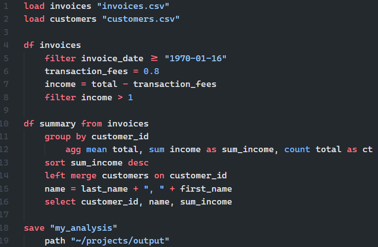

# Pivotal


**Pivotal** is a Python-based Domain-Specific Language (DSL) for data processing. It provides a clean, readable SQL-like syntax for common data operations which compiles to Python (pandas) code.


## At a Glance

The syntax of Pivotal has some similarites with "piped-SQL" varients including [PRQL](https://prql-lang.org), while replicating aspects of Python (i.e., indentation rather than brackets):



Check out this live demo of Pivotal in Jupyter lab:

[Pivotal in Jupyter Lab](https://mybinder.org/v2/gh/nealbob/pivotal-demo/HEAD?urlpath=%2Fdoc%2Ftree%2Ffootball_demo.ipynb)

### Features

**Readable, Writable Syntax** - Write data transformations in a simple SQL-like language

**Pandas-Powered** - Compiles to pandas, integrates with python code

**Pipeline-Oriented** - Piped by default. Chain operations naturally with indentation blocks

**JupyterLab Integration** - `%%pivotal` cell magic with autocomplete and syntax highlighting, interactive dataframe and chart viewer, no-code pivot tables and charts

**VS Code Integration** - Syntax highlighting, auto-complete, interactive execution, Python code export

**Plotting and table support** - Simple syntax for charts and tables via matplotlib and Great Tables

**Frictionless data-packages** - Export all notebook content (dataframes, charts, tables, code) to a single [Frictionless](https://specs.frictionlessdata.io/) data-package 
---

## Table of Contents

- [Installation](#installation)
- [Editor Integrations](#editor-integrations)
- [Quick Start](#quick-start)
- [Language Syntax](#language-syntax)
  - [Loading Data](#loading-data)
  - [Table Operations](#table-operations)
  - [Filtering](#filtering)
  - [Selecting Columns](#selecting-columns)
  - [Creating/Modifying Columns](#creatingmodifying-columns)
  - [Sorting](#sorting)
  - [Grouping and Aggregation](#grouping-and-aggregation)
  - [Window Functions](#window-functions)
  - [Merging Tables](#merging-tables)
  - [Pivot Tables](#pivot-tables)
  - [Unpivot (Melt)](#unpivot-melt)
  - [Data Cleaning](#data-cleaning)
    - [Delete a Table](#delete-a-table)
  - [Applying Python Functions](#applying-python-functions)
  - [Plotting](#plotting)
  - [Publication-Ready Tables](#publication-ready-tables)
  - [Package Management](#package-management)
- [API Reference](#api-reference)
- [Examples](#examples)

---

---

## Installation

### Core package

```bash
git clone https://github.com/nealbob/pivotal-py
cd pivotal-py
pip install .
```

Dependencies installed automatically: `lark`, `pandas`, `matplotlib`, `great-tables`, `numpy`, `ipywidgets`, `sqlalchemy`.

### JupyterLab Extension

```bash
cd editors/jupyterlab
jlpm install
jlpm run build
pip install -e .
```

### VS Code Extension

1. Install the [Python](https://marketplace.visualstudio.com/items?itemName=ms-python.python) and [Jupyter](https://marketplace.visualstudio.com/items?itemName=ms-toolsai.jupyter) extensions for VS Code
2. Install the Pivotal extension from the VS Code Marketplace, or build it locally:
   ```bash
   cd editors/vscode
   npm install
   npm run build
   ```
   Then install the generated `.vsix` file via **Extensions → Install from VSIX**.

Restart JupyterLab — the extension activates automatically.

---

## Editor Integrations

### VS Code

Open any `.pivotal` file in VS Code to get:

- **Syntax highlighting** for `.pivotal` files and `%%pivotal` blocks embedded in `.py` files
- **Execute File** (`Ctrl+F5` / `Cmd+F5`) — runs the file via `python -m pivotal` in the integrated terminal
- **Execute in Interactive Notebook** — sends the file to a VS Code Interactive Window as `%%pivotal` cells, with live DataFrame previews. Sections separated by `#%%` markers run as individual cells. The window opens to the right and is reused on subsequent runs.
- **Execute Selection** (`Ctrl+Shift+F5` / `Cmd+Shift+F5`) — sends the selected block to the Interactive Window
- **Compile to Python** — generates a `.py` file from the current `.pivotal` source and saves it alongside it
- **Autocomplete** — context-aware completions for commands, table names, column names, aggregation functions, and chart types (see [Autocomplete](#autocomplete) below)

All commands are also available via the Command Palette (`Ctrl+Shift+P`).

### JupyterLab

Use the `%%pivotal` cell magic in any notebook:

```
%%pivotal
load sales "data/sales.csv"

df sales
filter amount > 1000
group by region
    agg sum amount as total
sort total desc
```

- Syntax highlighting activates automatically on any cell whose first line is `%%pivotal`
- Run the cell normally — results are sent to the **Object Viewer** panel

#### Object Viewer

The Object Viewer is a persistent panel in the JupyterLab right sidebar. Each time a `%%pivotal` cell runs, the resulting DataFrames and charts are sent there automatically.

- **DataFrames** are displayed as a scrollable table with a sticky header and row index. Large tables use virtual scrolling so only visible rows are rendered — fast even with hundreds of thousands of rows.
- **Charts** are displayed as PNG images with zoom (+/−/1:1 buttons) and drag-to-pan.
- **Navigation** — use the ◀ / ▶ buttons or keyboard shortcuts to move between objects.

#### Keyboard Shortcuts

**Global (any focus)**

| Shortcut | Action |
|---|---|
| `Alt+P` | Insert new `%%pivotal` cell below |
| `Alt+V` | Show / focus the Object Viewer panel |
| `Alt+E` | Show / focus the Object Explorer panel |
| `Alt+N` | Return focus to the notebook |
| `Alt+[` | Viewer: navigate back |
| `Alt+]` | Viewer: navigate forward |

**Notebook command mode only (vim-style chords)**

| Chord | Action |
|---|---|
| `pp` | Insert new `%%pivotal` cell below |
| `vv` | Show / focus the Object Viewer panel |
| `ee` | Show / focus the Object Explorer panel |
| `nn` | Return focus to the notebook |

**Object Viewer** (click the viewer panel first to give it keyboard focus)

| Key | Action |
|---|---|
| `h` / `←` | Navigate back |
| `l` / `→` | Navigate forward |
| `j` | Zoom in (charts only) |
| `k` | Zoom out (charts only) |
| `dd` | Delete current object (also removes from Python namespace) |

**Object Explorer** (click the explorer panel first to give it keyboard focus)

| Key | Action |
|---|---|
| `j` / `↓` | Move focus down |
| `k` / `↑` | Move focus up |
| `l` / `→` | Expand column list (DataFrames) or open in viewer |
| `h` / `←` | Collapse expanded column list |
| `Enter` / `Space` | Open focused item in viewer |
| `Delete` or `dd` | Delete focused item (also removes from Python namespace) |

#### Output settings

Control where results appear using `%pivotal_set` (persistent) or per-cell overrides on the `%%pivotal` line:

```python
%pivotal_set output_type=viewer    # viewer (default) | inline | both
%pivotal_set output_code=true      # print the generated Python code
```

| Option | Values | Description |
|---|---|---|
| `output_type` | `viewer` (default) | Send DataFrames and charts to the Object Viewer only |
| | `inline` | Display results inline in the notebook cell output |
| | `both` | Send to viewer and display inline |
| `output_code` | `false` (default) | Do not print generated code |
| | `true` | Print the generated pandas code below the cell |

Override for a single cell:

```
%%pivotal output_type=inline output_code=true
df sales
filter amount > 1000
```

### Autocomplete

The VS Code extension provides context-aware completions for `.pivotal` files. Completions are triggered automatically as you type (after a space or tab).

| Context | Completions |
|---|---|
| Start of line | All Pivotal commands (`load`, `df`, `filter`, `sort`, …) |
| After `df` | Table names from the active session |
| After `filter`, `select`, `sort`, etc. | Column names for the active table |
| After `plot` | Chart types (`bar`, `line`, `scatter`, …) |
| After `agg` | Aggregation functions (`sum`, `mean`, `count`, …) |

Column names and table names are sourced from a `pivotal_autocomplete.json` file that the runtime writes to the working directory whenever a table is created or modified. The extension watches the file and reloads it automatically — no restart required.

---

## Quick Start

### In VS Code

1. Create a file named `analysis.pivotal`
2. Write your Pivotal code:
   ```
   load sales "data/sales.csv"

   df sales
   filter amount > 1000
   select customer_id, product, amount
   sort amount desc
   ```
3. Press `Ctrl+F5` to run in the terminal, or click **Execute in Interactive Notebook** in the title bar to see live DataFrame output

### In JupyterLab

Create a new notebook cell, set its first line to `%%pivotal`, and write your code:

```
%%pivotal
load sales "data/sales.csv"

df sales
filter amount > 1000
group by region
    agg sum amount as total
sort total desc
```

Run the cell — the resulting DataFrame displays inline.

### From the command line

```bash
python -m pivotal analysis.pivotal
```

### Programmatic API

```python
import pivotal

parser = pivotal.DSLParser()

dsl_code = """
load sales "sales_data.csv"

df sales
filter amount > 1000
select customer_id, product, amount
sort amount desc
"""

ns = {}
parser.execute(dsl_code, ns, verbose=False)
print(ns['sales'])
```

---

## Language Syntax

### Loading Data

Load data files into named tables. The file format is detected automatically from the extension:

```pivotal
# CSV
load sales "data/sales.csv"

# Excel
load budget "report.xlsx"

# Parquet
load events "events.parquet"

# With pandas reader options
load inventory "data/inventory_2024.csv"
    names ["product", "quantity", "price"]
    header 0

# From a runtime variable (path stored in a Python variable)
load df :my_path_variable
```

**Supported formats:** `.csv`, `.xlsx`, `.xls`, `.parquet`

**Parameters:** any keyword argument accepted by the underlying pandas reader (`read_csv`, `read_excel`, `read_parquet`).

**Package-based loading** (requires `_pivotal_pkg` to be set in the session — see [Package Management](#package-management)):

```pivotal
# Load a single named table from the active package's data/ folder
load clean

# Load all tables saved in the package at once
load all
```

---

### Table Operations

`df <name>` sets the active table for all following operations until the next `df` statement.

#### Set Active Table

```pivotal
# Work with an existing table
df sales
filter price > 100
select product, price
sort price desc
```

#### Create a Derived Table

```pivotal
# Copy from an existing table and work on the copy
df filtered_data from sales
filter price > 100
```


---

### Filtering

Filter rows based on conditions. Conditions go on the same line as `filter`:

```pivotal
# Comparison
df active_users from users
filter status == "active"

# Logical operators
df premium_sales from sales
filter amount > 1000 and category == "premium"

# Membership
df regional_data from sales
filter region in ["North", "South", "East"]

# Range (inclusive)
df mid_range from sales
filter price between [100, 500]

# String matching
df laptop_sales from sales
filter product contains "Laptop"

df recent from logs
filter event startswith "login"

df errors from logs
filter message not contains "warning"
```

**Supported Operators:**
- Comparison: `==`, `!=`, `>`, `<`, `>=`, `<=`
- Membership: `in`, `not in`
- Range: `between [lo, hi]`
- String: `contains`, `not contains`, `startswith`, `endswith`
- Logical: `and`, `or`

---

### Selecting Columns

Choose specific columns to keep:

```pivotal
df customer_summary from customers
select customer_id, name, email

df sales_metrics from sales
select product, quantity, revenue, profit_margin
```

---

### Creating/Modifying Columns

Create new columns or modify existing ones with assignment expressions:

```pivotal
# Simple calculation
df sales
total = price * quantity

# Conditional assignment (only sets the column where the condition is true)
df products from catalog
discount_price = price * 0.9
    where category == "clearance"

# Multiple operations chained
df analysis from sales
revenue = price * quantity
profit = revenue - cost
margin = profit / revenue
    where revenue > 0
```

**Multi-case assignment** (equivalent to SQL `CASE WHEN`):

```pivotal
df sales
tier =
    where amount > 500: amount * 2
    where amount > 100: amount
    0
```

Each `where cond: expr` branch is evaluated in order — the first matching condition wins. An optional bare expression at the end acts as the default (rows matching no condition get `None` if omitted).

> **Limitation:** branch expressions support arithmetic and column references only. Aggregate functions (`sum()`, `mean()`, etc.) and string functions (`upper()`, `left()`, etc.) are not supported inside multi-case branches — use a simple assignment for those.

```pivotal
# Decile binning using pct rank
df sales
rank amount pct as r
decile =
    where r > 0.9: 10
    where r > 0.8: 9
    where r > 0.7: 8
    where r > 0.6: 7
    where r > 0.5: 6
    where r > 0.4: 5
    where r > 0.3: 4
    where r > 0.2: 3
    where r > 0.1: 2
    1
```

**Aggregate functions inside expressions** — use `agg(col)` syntax to reference whole-table or group-level aggregates:

```pivotal
# Percent of total (whole table)
df sales
pct = amount / sum(amount)

# Percent of group total
df sales
pct = amount / sum(amount)
    by region

# Z-score normalisation
df sales
z = (amount - mean(amount)) / std(amount)

# Deviation from group mean
df sales
dev = amount - mean(amount)
    by region

# Deviation from weighted average (whole table)
df sales
dev = amount - wavg(amount, weight)

# Deviation from weighted average by group
df sales
dev = amount - wavg(amount, weight)
    by region
```

Supported functions: `sum`, `mean`, `min`, `max`, `count`, `std`, `median`, `var`, `nunique`, `first`, `last`, `wavg(col, weight)`.

**Arithmetic expressions:**
- Reference columns directly by name
- Standard arithmetic operators: `+`, `-`, `*`, `/`, `**`

**Built-in string functions:**

| Function | Description | Example |
|---|---|---|
| `upper(col)` | Upper-case | `code = upper(category)` |
| `lower(col)` | Lower-case | `slug = lower(name)` |
| `trim(col)` | Strip leading and trailing whitespace | `name = trim(name)` |
| `ltrim(col)` | Strip leading whitespace | `name = ltrim(name)` |
| `rtrim(col)` | Strip trailing whitespace | `name = rtrim(name)` |
| `left(col, n)` | First *n* characters | `abbr = left(name, 3)` |
| `right(col, n)` | Last *n* characters | `ext = right(filename, 4)` |
| `substr(col, start, n)` | Substring from *start*, length *n* | `mid = substr(code, 2, 5)` |
| `len(col)` | String length | `n = len(name)` |
| `replace(col, from, to)` | Replace substring | `clean = replace(notes, "N/A", "")` |

Functions can be nested: `up3 = upper(left(name, 3))`

**String concatenation** — use `+` with at least one quoted literal:

```pivotal
df customers
full_name = last_name + ", " + first_name
label     = upper(left(first_name, 1)) + ". " + last_name
```

**Calling a Python function** (function must be in the session namespace):

```pivotal
python
    def clean_price(s):
        return s.str.replace("$", "").astype(float)

df sales
price = clean_price(price)
```

---

### Sorting

Sort data by one or more columns:

```pivotal
# Single column, ascending (default)
df sorted_sales from sales
sort amount

# Single column, descending
df top_performers from sales
sort revenue desc

# Multiple columns
df ranked_products from sales
sort category asc, sales desc, price asc
```

**Sort Orders:**
- `asc` - Ascending (default)
- `desc` - Descending

---

### Grouping and Aggregation

Group rows and compute aggregate statistics with an indented `agg` block:

```pivotal
# Sum one column
df revenue_by_region from sales
group by region
    agg sum amount

# Multiple aggregations
df summary from sales
group by category
    agg sum amount as total, mean amount as avg_amount, count amount as n

# Group by multiple columns
df detailed from sales
group by region, category
    agg sum amount as total, max amount as peak
```

**Aggregation Functions:**

| Function | Description |
|---|---|
| `sum` | Total |
| `mean` / `avg` | Average |
| `count` | Non-null count |
| `min` / `max` | Minimum / maximum |
| `median` | Median |
| `std` | Standard deviation |
| `nunique` | Count of distinct values |
| `wavg col weight` | Weighted average |

```pivotal
# Count distinct products per category
df summary from sales
group by category
    agg nunique product as n_products, sum amount as total

# Weighted average price by region (weighted by quantity)
df wavg_price from sales
group by region
    agg wavg price quantity as avg_price
```

---

### Window Functions

Compute per-row statistics over a window of rows. All window statements add a new column to the active table without changing row order.

All share a common optional clause structure using indented sub-blocks:
- `by <cols>` — partition: compute independently within each group
- `order <col>` — sort by this column before computing (required for lag/lead/cumulative/rolling)
- `as <name>` — name for the new column (always required)

`by` and `order` are written as indented lines below the statement.

#### `rank`

Rank rows by a column. Rows keep their original order.

```pivotal
# Rank all rows by amount, highest = 1
rank amount desc as sales_rank

# Rank within each region independently
rank amount desc as regional_rank
    by region

# Filter to top 3 per region
rank amount desc as regional_rank
    by region
filter regional_rank <= 3
```

Add `pct` to get percentile ranks (0–1) instead of integer ranks. Useful for quantile binning:

```pivotal
# Percentile rank
rank amount pct as r

# Decile bins (1–10)
rank amount pct as r
decile = floor(r * 10) + 1
```

#### `lag` and `lead`

Access values from the previous (`lag`) or next (`lead`) row. Essential for period-over-period comparisons.

```pivotal
# Previous row's value (whole table, sorted by date)
df sales
lag amount 1 as prev_amount
    order date

# Previous value within each region
df sales
lag amount 1 as prev_amount
    by region
    order date

# Next row's value
df sales
lead amount 1 as next_amount
    by region
    order date

# Month-over-month change
df sales
lag amount 1 as prev_amount
    by region
    order date
change = amount - prev_amount
```

#### Cumulative functions

Running statistics that grow with each row.

```pivotal
# Running total
df sales
cumsum amount as running_total
    by region
    order date

# Running average
df sales
cummean amount as running_avg
    by region
    order date

# Running min / max
df sales
cummin amount as running_min
    order date
cummax amount as running_max
    order date
```

| Statement | Description |
|---|---|
| `cumsum` | Running total |
| `cummean` | Running (expanding) mean |
| `cummin` | Running minimum |
| `cummax` | Running maximum |

#### `rolling`

Sliding window over the last N rows.

```pivotal
# 7-period rolling average (whole table)
df sales
rolling mean amount 7 as rolling_avg
    order date

# Rolling average per region
df sales
rolling mean amount 7 as rolling_avg
    by region
    order date

# Rolling sum
df sales
rolling sum amount 4 as rolling_total
    by region
    order date
```

Supported functions: `mean`, `sum`, `min`, `max`, `std`.

The first `N-1` rows of each window produce `NaN` since there are not yet enough rows to fill the window.

---

### Merging Tables

Merge two tables together:

```pivotal
# Inner merge (default)
df combined from sales
merge other_table on customer_id

# Left merge
df sales_with_customers from sales
left merge customers on customer_id

# Outer merge
df full_data from table1
outer merge secondary on id

# Merge on multiple keys
df matched from table1
merge other on key1, key2
```

**Merge Types:**
- `merge` or `inner merge` — inner (intersection)
- `left merge` — left (all left, matching right)
- `right merge` — right (all right, matching left)
- `outer merge` — outer (union)

**Advanced Parameters:**
```pivotal
df complex_merge from table1
left merge table2
    left_on id
    right_on customer_id
    suffixes ["_left", "_right"]
```

Accepts all keyword arguments of `pandas.merge()`.

---

### Pivot Tables

Create pivot tables with aggregations:

```pivotal
# Basic pivot
df sales_pivot from sales
pivot
    agg sum amount
    rows product
    cols region

# Multiple aggregations on multiple columns
df multi_metric_pivot from sales
pivot
    agg sum revenue, mean quantity
    rows category
    cols quarter

# Complex pivot with multiple functions per column
df detailed_summary from sales
pivot
    agg sum sales, mean profit, sum units
    rows product, category
    cols region, quarter
```

**Aggregation Functions:**
- `sum` - Sum of values
- `mean` / `avg` - Average value
- `count` - Count of values
- `min` - Minimum value
- `max` - Maximum value
- `median` - Median value
- `std` - Standard deviation

---

### Unpivot (Melt)

The inverse of `pivot` — collapse wide columns into rows. Requires an indented block.

```pivotal
# Minimal: id only — all other columns are melted
df monthly_sales
unpivot
    id region

# Specify which columns to melt
df monthly_sales
unpivot
    id region
    cols jan, feb, mar

# Custom column names for the result
df monthly_sales
unpivot
    id region
    cols jan, feb, mar
    variable "month"
    value "amount"
```

| Option | Required | Description |
|---|---|---|
| `id <cols>` | Yes | Columns to keep as identifier variables |
| `cols <cols>` | No | Columns to melt (default: all non-id columns) |
| `variable "string"` | No | Name for the new variable column (default: `"variable"`) |
| `value "string"` | No | Name for the new value column (default: `"value"`) |

The result is the active table reshaped from wide to long format.

---

### Data Cleaning

#### Drop Columns

Remove one or more columns:

```pivotal
df clean from sales
drop id, internal_ref
```

#### Rename Columns

Rename columns with `as`:

```pivotal
df renamed from sales
rename product as item, quantity as qty, unit_price as price
```

#### Handle Missing Values

Fill or drop rows with null values:

```pivotal
# Fill all nulls with a scalar value
df filled from raw
fillna 0

df filled_str from raw
fillna "unknown"

# Drop rows that contain any null
df complete from raw
dropna

# Drop rows where specific columns are null
df complete from raw
dropna price, quantity
```

#### De-duplicate

Remove duplicate rows:

```pivotal
# Remove fully duplicate rows
df unique from sales
distinct

# Remove duplicates based on specific columns
df unique from sales
distinct product, category
```

#### Delete a Table

Remove a DataFrame from memory and from the Object Viewer:

```pivotal
delete sales
```

This is equivalent to calling `pivotal.delete('sales')` in a Python cell. The table is removed from the kernel namespace, the Object Viewer panel, and the left-panel item list. You can also right-click any item in the Object Viewer's left panel and choose **Delete**, or press **Del** after clicking a row.

#### Concatenate Tables

Stack tables vertically:

```pivotal
# Append one table to another
df combined from jan_sales
concat feb_sales

# Append multiple tables at once
df all_sales from q1
concat q2, q3, q4
```

---

### Applying Python Functions

Define functions in a `python` block and call them from assignment expressions or `apply`.

#### Python block syntax

A `python` line can be used in two ways:

**Single-line** — put the code directly on the same line:
```pivotal
df sales
python sales["full_name"] = sales["last"] + ", " + sales["first"]
```

**Multi-line block** — write an indented block and close it with `end`:
```pivotal
python
    def clean_price(s):
        return s.str.replace("$", "").astype(float)

    def initials(s):
        return s.str[0].str.upper()
end

df sales
price = clean_price(price)
abbr  = initials(name)
```

The `end` keyword is required to close a multi-line `python` block. It must appear at the same indentation level as the opening `python` keyword.

#### Assigning with a user function

When the expression is a user-defined function call `func(col)`, Pivotal generates
`df['target'] = func(df['col'])` instead of routing through `df.eval()`:

```pivotal
python
    def clean_price(s):
        return s.str.replace("$", "").astype(float)

    def initials(s):
        return s.str[0].str.upper()
end

df sales
price = clean_price(price)
abbr  = initials(name)
```

#### `apply` — DataFrame-level transforms

`apply func_name` passes the entire active DataFrame through `func_name` and assigns
the result back:

```pivotal
python
    def remove_outliers(df):
        lo = df["price"].quantile(0.05)
        hi = df["price"].quantile(0.95)
        return df[df["price"].between(lo, hi)]
end

df sales
apply remove_outliers
group by category
    agg mean price as avg_price
```

---

### plotting

Create charts from the active table using `plot`. Each plot must be given a name so it
can be referenced in `save` include/exclude lists.

```pivotal
# Basic plot (name only, chart type set via params)
df summary
plot revenue_chart
    kind "bar"
    x category
    y total_revenue
    title "Revenue by Category"

# Shorthand: chart type as the first argument, name second
df summary
plot bar revenue_chart
    x category
    y total_revenue
    title "Revenue by Category"

# Line chart
df trends
plot line price_trend
    x date
    y price
    legend False

# Scatter chart
df raw
plot scatter price_vs_qty
    x price
    y quantity
    c category
    colormap "viridis"
```

All keyword arguments accepted by `DataFrame.plot()` can be passed as indented
parameters (e.g. `figsize`, `title`, `xlabel`, `ylabel`, `legend`, `colormap`, etc.).

#### Faceted subplots with `by`

Use `by <column>` to create one subplot per unique value of a column. `cols` sets the
number of columns in the grid (rows are calculated automatically):

```pivotal
df sales
plot bar regional_chart
    x category
    y revenue
    by region
    cols 2
```

Empty subplot cells are hidden automatically and `tight_layout()` is applied.

#### Style files

Use `style <name>` to apply a matplotlib style before rendering the chart:

```pivotal
df summary
plot bar revenue_chart
    x category
    y total
    style reports
```

The `<name>` is resolved in this order:

1. `<name>.mplstyle` in the current working directory
2. `styles/<name>.mplstyle` relative to the current working directory
3. A built-in matplotlib style name (e.g. `ggplot`, `seaborn-v0_8`, `bmh`, `dark_background`)

A `.mplstyle` file is a plain text file of matplotlib rcParams:

```ini
figure.figsize: 10, 6
axes.titlesize: 14
axes.labelsize: 12
font.family: serif
axes.grid: True
grid.alpha: 0.3
```

Run `import matplotlib.pyplot as plt; print(plt.style.available)` in Python to see all
built-in style names.

Charts are stored in the session and exported automatically by `save`.  Each chart is
saved as both an image (`charts/<name>.png`) and a CSV snapshot of the source data
(`charts/<name>.csv`).

> **Naming constraint:** chart names must not duplicate any table name in the session,
> since both share the same identifier namespace in `include`/`exclude` lists.

---

### Publication-Ready Tables

Create formatted HTML tables using the [Great Tables](https://posit-dev.github.io/great-tables/articles/intro.html) package. Each table must be named and is displayed in the Object Viewer panel; the `save` command exports it as a self-contained `.html` file.

**Requires:** `pip install great-tables`

```pivotal
df results

table summary
    title "Season Results"
    subtitle "All matches, 2023–24"
    font size 11
    font "Georgia"
    stub team, division "Club"
    spanner goals, win_rate "Performance"
    spanner revenue "Financials"
    label goals as "Goals Scored", win_rate as "Win %", revenue as "Revenue"
    format number 1
    format revenue as currency GBP
    format win_rate as percent 1
    summary sum as "Total", mean as "Average"
    stripe
    canvas a4
    style "my_table_style.py"
```

#### Table options

| Option | Description |
|---|---|
| `title "string"` | Table heading |
| `subtitle "string"` | Sub-heading below the title |
| `font size <n>` | Font size in points (applied to body, stub, column labels, and header) |
| `font "family"` | Font family name (e.g. `"Georgia"`, `"Arial"`) |
| `stub <col> [, <group>] ["label"]` | Row label area — see [Stub and row groups](#stub-and-row-groups) below |
| `spanner <cols> "label"` | Add a spanner label above a group of columns |
| `auto spanner` | Auto-generate spanners from MultiIndex columns (pivot output) |
| `stripe` | Alternating row background colours (zebra striping) |
| `canvas <size>` | Render on a page-sized canvas in the viewer; omit for free-scrolling |
| `summary <fns>` | Add grand summary rows (see below) |
| `style "file.py"` | Apply a custom style function from an external Python file (see below) |

**Canvas sizes:**

| Value | Size |
|---|---|
| `a4` | 210 × 297 mm (portrait) |
| `a4_landscape` | 297 × 210 mm |
| `a3` | 297 × 420 mm (portrait) |
| `a3_landscape` | 420 × 297 mm |
| `letter` | 216 × 279 mm (portrait) |
| `slide` | 339 × 191 mm (16:9 widescreen, PPT/Beamer) |

Canvas can also be set globally with `%pivotal_set canvas=a4` and overridden per-table with the `canvas` line. Default page margins are 25.4 mm (2.54 cm).

#### Stub and row groups

The `stub` line pulls one column into a styled left row-label area and optionally groups rows under a second column's values:

```pivotal
stub product                           -- simple stub column
stub product "Product"                 -- stub with a header label above it
stub product, category                 -- stub + group rows by category
stub product, category "Product"       -- all three: stub, grouping, and label
```

| Syntax | Effect |
|---|---|
| `stub col` | `rowname_col=col` — styled stub; text is automatically set to `nowrap` |
| `stub col "Label"` | Adds `tab_stubhead(label="Label")` above the stub column |
| `stub col, group` | `rowname_col=col, groupname_col=group` — rows grouped under unique `group` values |
| `stub col, group "Label"` | All three: stub column, row grouping, and stubhead label |

When a `group` column is provided, Great Tables renders a shaded section header above each group of rows. The group column is consumed by GT and does not appear as a data column.

#### Spanner labels

Spanners are horizontal labels that span across two or more column headers. Two approaches are supported.

**Manual** — specify the columns and a label explicitly:

```pivotal
spanner price, quantity "Metrics"
spanner revenue, cost, profit "Financials"
```

Each `spanner` line generates a `tab_spanner(label=..., columns=[...])` call. Multiple `spanner` lines can be stacked to create multiple groups.

**Auto** — derive spanners from MultiIndex columns produced by `pivot`:

```pivotal
df monthly_sales from raw
pivot
    agg sum revenue, sum quantity
    rows product
    cols region

table t1
    stub product "Product"
    auto spanner
```

When `auto spanner` is used, the generated code:
1. Detects whether the DataFrame has MultiIndex columns
2. Flattens column names (joining levels with `|`) so that Great Tables can accept the DataFrame
3. Calls `tab_spanner()` once per top-level column group

If the DataFrame has regular (non-MultiIndex) columns, the `auto spanner` line has no effect.

#### Column labels (`label`)

Rename multiple columns on a single comma-separated line:

```pivotal
label colA as "Cost", colB as "Revenue", colC as "Margin %"
```

#### Column formatting (`format`)

Apply a number format to a specific column or to all numeric columns at once. Blanket formats automatically skip string/object columns.

```pivotal
format number 2              -- all numeric columns, 2 decimal places
format integer               -- all numeric columns, no decimals
format colA as number 2      -- specific column only
format colB as currency GBP  -- specific column, currency format
```

**Format types:**

| Format | Syntax | Description |
|---|---|---|
| `number <decimals>` | `format number 1` | Fixed decimal places |
| `integer` | `format integer` | No decimal places |
| `currency <code>` | `format revenue as currency GBP` | Currency symbol + 2 dp |
| `percent <decimals>` | `format rate as percent 1` | Percentage |
| `date` | `format created as date` | Date formatting |

#### Summary rows (`summary`)

Add grand summary rows at the bottom of the table. Each aggregation becomes a labelled row. String/object columns are automatically excluded.

```pivotal
summary sum                              -- one row labelled "Total"
summary sum as "Total"                   -- explicit label
summary sum as "Total", mean as "Mean"   -- multiple rows
```

**Supported aggregations:** `sum`, `mean`, `min`, `max`, `median`, `count`

Default labels (when no `as` is given): Sum → *Total*, Mean → *Mean*, Min → *Min*, Max → *Max*, Median → *Median*, Count → *Count*.

> Note: Group-level subtotals (`summary_rows`) are not yet available in the current version of Great Tables (v0.21). Grand summary rows apply across all data regardless of grouping.

#### Style files

For complex styling (bold headings, custom colours, borders, backgrounds), provide a Python file with an `apply(gt)` function. This gives full access to the Great Tables API without polluting the grammar.

```pivotal
table myreport
    style "report_style.py"
```

```python
# report_style.py
import great_tables.style as s
import great_tables.loc as loc

def apply(gt):
    return (gt
        .tab_style(style=s.text(weight='bold'), locations=loc.column_labels())
        .tab_style(style=s.fill(color='#f0f4f8'), locations=loc.header())
        .tab_style(style=s.borders(sides='bottom', color='#333', weight='2px'),
                   locations=loc.column_labels())
    )
```

The file path is relative to the notebook's working directory.

#### Viewer display

Tables appear in the **Object Viewer** with a distinct icon in the **Object Explorer** sidebar. If `canvas` is set the table is rendered on a page-sized background; otherwise it fills the panel. If content is wider than the canvas it overflows naturally — no auto-scaling is applied.

#### Export

Tables are exported as self-contained HTML files by `save`:

```
my_analysis/
  tables/
    summary.html    ← fully self-contained, inline CSS
```

---

### Package Management

A **package** is a self-contained folder of exported data tables and charts:

```
my_analysis/
  datapackage.json    ← resource manifest
  data/
    sales.csv
    summary.parquet
  charts/
    revenue_chart.png    ← chart image
    revenue_chart.csv    ← chart source data (snapshot of the DataFrame at plot time)
```

Code lives wherever it lives — the package is output only.

#### `save` — export a package snapshot

```pivotal
# Save all tables and charts in the session to a package
save "my_analysis"
    path "~/projects/output"

# Parquet format for tables
save "my_analysis"
    path "~/projects/output"
    format parquet

# Include only specific tables and/or charts (names are shared across both)
save "my_analysis"
    path "~/projects/output"
    include sales, summary, revenue_chart

# Exclude specific tables or charts
save "my_analysis"
    path "~/projects/output"
    exclude raw_import, debug_plot

# Change chart image format (default: png)
save "my_analysis"
    path "~/projects/output"
    chart_format svg
```

`save` is a **snapshot export** — each call wipes and recreates the package folder,
equivalent to Save-As.  Calling it twice with the same name and path overwrites the
first.  Use different names or paths to keep intermediate snapshots:

```pivotal
-- snapshot after cleaning
save "sales_v1_clean"
    path "~/output"

-- snapshot after enrichment
save "sales_v1_enriched"
    path "~/output"
```

Charts created by `plot` are tracked automatically and included in the export.
Each chart is saved as both an image and a CSV of the underlying data:

```pivotal
df summary
plot bar revenue_chart
    x category
    y total_revenue

save "my_analysis"
    path "~/output"
    -- saves summary table, revenue_chart.png, and revenue_chart.csv
```

> **Note:** chart names and table names share the same namespace in `include`/`exclude`
> lists, so they must be unique across both within a session.

#### `load` from a package

To load from a previously saved package, open it via a `python` block and then use
`load all` or `load <table>`:

```pivotal
python
    from pivotal import Package
    _pivotal_pkg = Package.open("my_analysis", path="~/projects/output")
end

load all

df summary
filter total_revenue > 1000
sort total_revenue desc
```

#### Example: two-file pipeline

```pivotal
-- pipeline.pivotal — process and export
load raw "raw/sales_2024.csv"

df clean from raw
dropna amount, customer_id
distinct

df summary from clean
group by category
    agg sum amount as total, count amount as n
sort total desc

plot bar revenue_chart
    x category
    y total
    title "Revenue by Category"

save "sales_pipeline"
    path "~/projects/output"
    format parquet
    -- saves clean, summary tables and revenue_chart image + data CSV
```

```pivotal
-- analysis.pivotal — reload and continue
python
    from pivotal import Package
    _pivotal_pkg = Package.open("sales_pipeline", path="~/projects/output")
end

load all

df top from summary
filter total > 10000
sort total desc
```

---


## API Reference

### DSLParser

```python
parser = pivotal.DSLParser(backend="pandas")
```

**`backend`** — code generation backend: `"pandas"` (default).

#### Methods

##### `parse(code: str) -> list`
Parse DSL code and return the AST (a list of statement dicts).

```python
ast = parser.parse(dsl_code)
```

Raises `ValueError` for keyword-collision errors; returns `{'error': ...}` for
all other parse errors.

##### `generate_code(ast: list, backend: str = "pandas") -> list[str]`
Convert an AST to a list of Python code-block strings.

```python
blocks = parser.generate_code(ast)
```

##### `execute(code: str, globals_dict: dict, backend: str = "pandas", verbose: bool = True) -> None`
Parse and execute DSL code in one step, modifying `globals_dict` in place.

```python
ns = {}
parser.execute(dsl_code, ns, verbose=False)
# ns now contains all loaded/computed DataFrames
```

**Parameters:**
- `code` — Pivotal DSL code string
- `globals_dict` — namespace dict to execute in; DataFrames are added here
- `backend` — `"pandas"` (default)
- `verbose` — print execution summary (default: `True`)

##### `export(code: str) -> str | None`
Parse DSL code and return the generated Python as a single clean string, ready to
save as a `.py` file.  Internal Pivotal bookkeeping markers are stripped and
`import pandas as pd` is prepended automatically.

```python
python_script = parser.export(open("analysis.pivotal").read())

with open("analysis.py", "w") as f:
    f.write(python_script)
```

Returns `None` (and prints the error) if the DSL fails to parse.

##### `parse_file(path: str) -> list`
Convenience wrapper: read a `.pivotal` file and return its AST.

### Package

#### `Package.export()` — create a package from the session

```python
pkg = pivotal.Package.export(
    name="my_analysis",
    namespace=globals(),
    path="~/projects/output",        # optional, defaults to CWD
    fmt="csv",                       # "csv" (default) or "parquet"
    chart_fmt="png",                 # image format: "png" (default), "svg", "pdf", etc.
    include=["sales", "revenue_chart"],  # optional: names of tables and/or charts to include
    exclude=["raw", "debug_plot"],       # optional: names to skip
)
```

Each call wipes and recreates the package folder (Save-As semantics).

Charts are stored as `{'fig': figure, 'data': dataframe}` in the session's
`_pivotal_charts` dict.  `export()` writes each chart as both an image file
and a CSV of the source data.

#### `Package.open()` — open an existing package for loading

```python
pkg = pivotal.Package.open("my_analysis", path="~/projects/output")
```

| Method | Description |
|---|---|
| `export(name, namespace, path, fmt, chart_fmt, include, exclude)` | Export a fresh package snapshot |
| `open(name, path)` | Open an existing package for loading |
| `load_table(name)` | Load one table from `data/` (parquet preferred over CSV) |
| `load_all()` | Return a `{name: DataFrame}` dict of all tables in `data/` |

---

## Examples

### Example 1: Sales Analysis

```pivotal
# Load sales data
load sales "sales_data.csv"
    header 0

load products "product_catalog.csv"

# Filter high-value sales
df high_value from sales
filter amount > 500
select customer_id, product_id, amount, date

# Merge with product info
df enriched_sales from high_value
left merge products on product_id
select customer_id, product_name, category, amount

# Calculate metrics
df analysis from enriched_sales
revenue = amount
is_premium = amount > 1000

# Create summary pivot
df category_summary from analysis
pivot
    agg sum revenue, mean revenue, count revenue
    rows category
    cols is_premium
```

### Example 2: Customer Segmentation

```pivotal
# Load customer data
load customers "customer_data.csv"
load transactions "transaction_log.csv"

# Aggregate by customer
df customer_summary from transactions
group by customer_id
    agg sum amount as total_spent

# Segment customers
df segments from customer_summary
segment = "low"

df high_value from segments
segment = "high"
    where total_spent > 1000

df medium_value from segments
segment = "medium"
    where total_spent > 500 and total_spent <= 1000
```

### Example 3: Time Series Analysis

```pivotal
# Load time series data
load timeseries "sensor_data.csv"
    header 0

# Filter by date range
df recent_data from timeseries
filter date >= "2024-01-01"
select sensor_id, date, temperature, humidity

# Calculate derived columns
df with_metrics from recent_data
temp_fahrenheit = temperature * 9 / 5 + 32
comfort_index = temperature * 0.7 + humidity * 0.3

# Sort chronologically
df chronological from with_metrics
sort date asc, sensor_id asc

# Create pivot by sensor
df sensor_pivot from chronological
pivot
    agg mean temperature, min temperature, max temperature
    rows date
    cols sensor_id
```

### Example 4: Data Cleaning Pipeline

```pivotal
# Load data
load raw_data "input.csv"

# Drop columns we don't need
df trimmed from raw_data
drop internal_id, last_modified

# Rename for clarity
df renamed from trimmed
rename cust_nm as customer_name, val as value, cat as category

# Remove rows with missing critical fields
df no_nulls from renamed
dropna customer_name, value

# Fill remaining nulls in non-critical fields
df filled from no_nulls
fillna "uncategorised"

# Remove duplicates on key columns
df deduped from filled
distinct customer_name, value, category

# Filter to valid range and known categories
df final_data from deduped
filter value between [0, 10000]
filter category not contains "test"
sort value desc
```

---

## Comments

Pivotal supports single-line and multi-line comments:

```pivotal
# This is a single-line comment

-- This is also a single-line comment

/*
This is a
multi-line comment
*/

load data file.csv
   # Comments can appear anywhere
   header 0  -- Even after code
```

---

## Tips & Best Practices

### 1. **Use Descriptive Table Names**
```pivotal
# Good
df high_value_customers from customers
filter total_spent > 1000

# Less clear
df t1 from customers
filter total_spent > 1000
```

### 2. **Chain Operations on the Active Table**
```pivotal
df analysis from raw_data
filter status == "active"      # filter first
select id, name, value          # then narrow columns
normalized = value / 100 # then compute
sort normalized desc             # finally sort
```

### 3. **Use Indentation Consistently**
Pivotal uses indentation to define sub-blocks (`agg`, `where`, `pivot` params, `save` params). Use 4 spaces; do not mix tabs and spaces.

### 4. **Break Complex Pipelines into Named Steps**
```pivotal
df step1 from raw_data
filter condition1

df step2 from step1
merge other_data on key

df final from step2
select needed_columns
```

### 5. **Test Incrementally**
Execute code step-by-step in an interactive session to verify each operation.

---

## Troubleshooting

### Common Issues

**Import Error: `No module named 'pivotal'`**
- Ensure you have installed the package: `pip install .`
- Check that your virtual environment is active

**Parse Error: Unexpected indentation**
- Check that indentation is consistent (use spaces, not tabs)
- Ensure nested operations are properly indented

**Table Not Found Error**
- Make sure to `load` or create a table before referencing it
- Check table name spelling

**Column Not Found Error**
- Verify column exists in the table
- Check for typos in column names
- Use `print(table_name.columns)` to see available columns

---

## Advanced Usage

### Compile to Python Script

From the command line:

```bash
python -m pivotal --compile analysis.pivotal
# writes analysis.py alongside analysis.pivotal
```

Programmatically using `export()`, which strips internal markers and adds the pandas
import automatically:

```python
import pivotal

parser = pivotal.DSLParser()
script = parser.export(open("analysis.pivotal").read())

with open("analysis.py", "w") as f:
    f.write(script)
```

### Programmatic Execution

```python
import pivotal

parser = pivotal.DSLParser()
ns = {}
parser.execute(open("analysis.pivotal").read(), ns, verbose=False)

# DataFrames are in ns
print(ns["analysis"].describe())
```

### Package API

```python
import pivotal
import pandas as pd

# Export a package from the current session
sales = pd.read_csv("sales.csv")
summary = sales.groupby("category")["amount"].sum().reset_index()

pkg = pivotal.Package.export(
    "my_analysis",
    namespace={"sales": sales, "summary": summary},
    path="~/projects/output",
    fmt="parquet",
    chart_fmt="png",           # optional, default is "png"
    include=["sales", "summary"],  # optional include list
)

# Open a previously saved package and load tables
pkg = pivotal.Package.open("my_analysis", path="~/projects/output")
tables = pkg.load_all()   # returns {"sales": DataFrame, "summary": DataFrame}
sales = pkg.load_table("sales")
```

---

## Contributing

Contributions are welcome! 

---

## License

[Specify your license here]

---

## Authors

Neal Hughes

---

## Version History

- **v0.1.0** - Initial release
 

---

## Contact & Support

For questions, issues, or feature requests, please contact hughes.neal@gmail.com.
