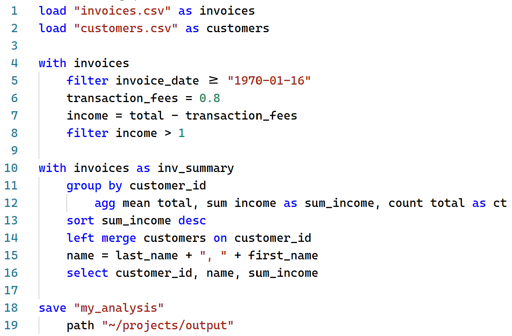
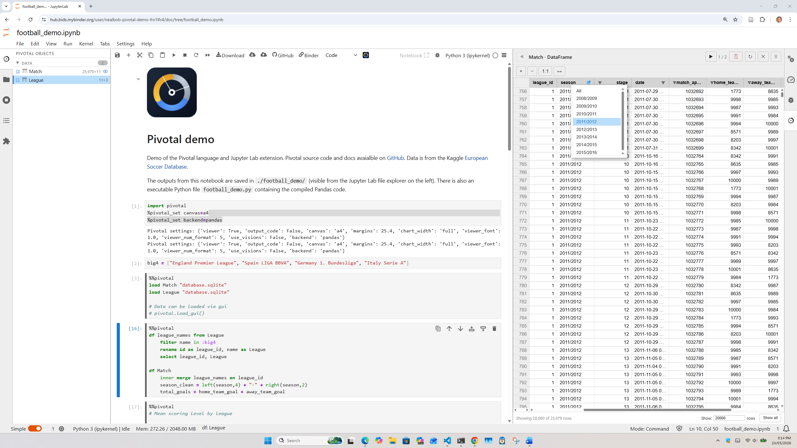

# Pivotal


**Pivotal** is a data processing language with a concise, readable syntax that compiles to Python code via either Pandas, Polars or DuckDB. Analyze and process your data interactively in Python without getting bogged down in Pandas syntax or SQL.



A live-demo of [Pivotal in Jupyter Lab](https://mybinder.org/v2/gh/nealbob/pivotal-demo/HEAD?urlpath=%2Fdoc%2Ftree%2Ffootball_demo.ipynb) is available via Binder:

[](https://mybinder.org/v2/gh/nealbob/pivotal-demo/HEAD?urlpath=%2Fdoc%2Ftree%2Ffootball_demo.ipynb)

## Features

**Readable, Writable syntax** — write data transformations in a simple declarative syntax

**Multiple backends** — compile to Pandas (default) or in-process DuckDB (SQL)

**JupyterLab integration** — `%%pivotal` cell magic, live object viewer, syntax highlighting, autocomplete, export to Python code

**VS Code integration** — syntax highlighting, autocomplete, interactive execution and code export

**Plotting and tables** — simple syntax for charts and publication-ready tables via matplotlib and Great Tables

**Data packages** — export all output (DataFrames, charts, tables) to a single [Frictionless](https://specs.frictionlessdata.io/) data package

---

## Installation

```bash
pip install pivotal
```

With optional extras:

```bash
pip install pivotal[duckdb]    # DuckDB backend
pip install pivotal[jupyter]   # Jupyter GUI widgets
pip install pivotal[tables]    # Great Tables support
pip install pivotal[all]       # Everything
```

### JupyterLab extension

```bash
pip install git+https://github.com/nealbob/pivotal-py.git#subdirectory=editors/jupyterlab
```

### VS Code extension

Install from the VS Code Marketplace, or build locally from `editors/vscode`.

---

## Documentation

Full documentation including the complete syntax reference, backend guide, and API reference:

**[nealbob.github.io/pivotal-py](https://nealbob.github.io/pivotal-py)**

---

## Contributing

Contributions are welcome! Please open an issue or pull request on GitHub.

---

## License

MIT

---

## Authors

Neal Hughes

---

## Version History

- **v0.1.0** — Initial release

---

## Contact & Support

For questions, issues, or feature requests please open an issue on GitHub or contact [hughes.neal@gmail.com](mailto:hughes.neal@gmail.com).
