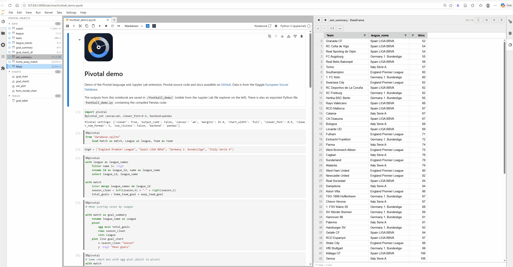

# Pivotal

Pivotal is a data analysis language for Python. It offers a concise syntax for common data operations that compiles to Pandas, Polars or DuckDB code. With comprehensive JupyterLab and VS Code support (syntax highlighting, autocomplete, interactive viewer and GUI controls) Pivotal provides a friendly entry point to the Python data ecosystem.

<div class="home-grid">
  <a class="home-tile" href="whypivotal/">
    <strong>Why Pivotal?</strong>
  </a>
  <a class="home-tile" href="getting-started/">
    <strong>Getting Started</strong>
  </a>
  <a class="home-tile" href="tutorial (10 minutes to Pivotal)/">
    <strong>Tutorial</strong>
  </a>
  <a class="home-tile" href="syntax/">
    <strong>User Guide</strong>
  </a>
  <a class="home-tile" href="syntax/command-reference/">
    <strong>Syntax Reference</strong>
  </a>
  <a class="home-tile" href="pandas-cheatsheet/">
    <strong>Pandas Cheatsheet</strong>
  </a>
</div>

A live-demo of [Pivotal in Jupyter Lab](https://mybinder.org/v2/gh/nealbob/pivotal-demo/HEAD?urlpath=%2Fdoc%2Ftree%2Ffootball_demo.ipynb) is available via Binder:

[](https://mybinder.org/v2/gh/nealbob/pivotal-demo/HEAD?urlpath=%2Fdoc%2Ftree%2Ffootball_demo.ipynb)

## Key features

**Readable, writable syntax** - write data transformations in a concise declarative syntax that feels familiar to SQL and Pandas users

**Multiple backends** - compile to Pandas, Polars, or in-process DuckDB SQL

**JupyterLab and VS Code integration** - syntax highlighting, autocomplete, `%%pivotal` cell magic, interactive object viewer and explorer, and GUI controls

**AI support** - ask an LLM or coding agent to generate, run, verify, and compare Pivotal code via the Pivotal MCP server

**Comprehensive data pipelines** - build full workflows with data-quality checks, pipeline functions, column loops, and loadable config / metadata values

**Plotting and tables** - create charts and publication-ready tables with simple syntax, backed by matplotlib and Great Tables

**Data packages** - export DataFrames, charts, and tables to a single [Frictionless](https://specs.frictionlessdata.io/) data package

**Python integration** - call Python functions, load Python variables, and mix Pivotal and Python code as needed

## Install

```bash
pip install pivotal-lang
```

This installs the full feature set - Pandas, Polars, DuckDB, Great Tables.

For a minimal Pandas-only install:

```bash
pip install --no-deps pivotal-lang
pip install lark pandas matplotlib
```

## Quick example

=== "Jupyter"

    ```python
    %%pivotal
    load "orders.csv" as orders

    with orders as monthly
        filter status == "complete"
        assign month = left(date, 7)
        group by month
            agg sum amount as revenue, count id as n_orders
        sort month
    ```

=== "Python API"

    ```python
    from pivotal import DSLParser

    parser = DSLParser()
    parser.execute("""
    load "orders.csv" as orders

    with orders as monthly
        filter status == "complete"
        assign month = left(date, 7)
        group by month
            agg sum amount as revenue, count id as n_orders
        sort month
    """)
    ```

=== ".pivotal file"

    ```
    # monthly_report.pivotal
    load "orders.csv" as orders

    with orders as monthly
        filter status == "complete"
        assign month = left(date, 7)
        group by month
            agg sum amount as revenue, count id as n_orders
        sort month
    ```

    ```bash
    pivotal monthly_report.pivotal
    ```
