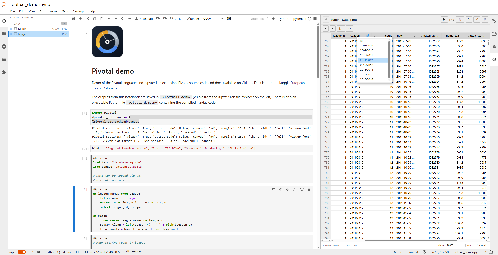

# Pivotal


Pivotal is a data analysis language for Python.  It offers a concise syntax for common data operations that compiles to Pandas, Polars or DuckDB code.  The JupyterLab and VS Code extensions provide autocomplete, an interactive viewer and GUI controls, making Pivotal a friendly entry point to the Python data ecosystem.


```pivotal
load "invoices.csv" as invoices
load "customers.csv" as customers

with invoices
    filter invoice_date >= "1970-01-16"
    transaction_fees = 0.8
    income = total - transaction_fees
    filter income > 1

with invoices as summary
    group by customer_id
        agg mean total, sum income as sum_income, count total as ct
    sort sum_income desc
    left merge customers on customer_id
    name = last_name + ", " + first_name
    select customer_id, name, sum_income

save "my_analysis"
    path "~/projects/output"
```

A live-demo of [Pivotal in Jupyter Lab](https://mybinder.org/v2/gh/nealbob/pivotal-demo/HEAD?urlpath=%2Fdoc%2Ftree%2Ffootball_demo.ipynb) is available via Binder:

[](https://mybinder.org/v2/gh/nealbob/pivotal-demo/HEAD?urlpath=%2Fdoc%2Ftree%2Ffootball_demo.ipynb)

## Key features

- **Readable, Writable syntax** — write data transformations in a simple declarative syntax
- **Multiple backends** — run the same code as Pandas, Polars or DuckDB/SQL
- **Jupyter integration** — `%%pivotal` cell magic with a live viewer panel
- **VS Code integration** — syntax highlighting, autocomplete, and one-key execution
- **Export to code** — compile any notebook or `.pivotal` file to `.py` or `.sql`
- **Plotting & tables** — built-in chart and publication-ready table support
- **Data packages** — export all output (DataFrames, charts, tables) to a single [Frictionless](https://specs.frictionlessdata.io/) data package
  
## Install

```bash
pip install pivotal
```

This installs the full feature set — Pandas, Polars, DuckDB, Great Tables.

For a minimal Pandas-only install:

```bash
pip install --no-deps pivotal
pip install lark pandas matplotlib

## Quick example

=== "Jupyter"

    ```python
    %%pivotal
    load "orders.csv" as orders

    with orders as monthly
        filter status == "complete"
        assign month = left(date, 7)
        group by month
            agg sum amount as revenue, count id as n_orders
        sort month
    ```

=== "Python API"

    ```python
    from pivotal import DSLParser

    parser = DSLParser()
    parser.execute("""
    load "orders.csv" as orders

    with orders as monthly
        filter status == "complete"
        assign month = left(date, 7)
        group by month
            agg sum amount as revenue, count id as n_orders
        sort month
    """)
    ```

=== ".pivotal file"

    ```
    # monthly_report.pivotal
    load "orders.csv" as orders

    with orders as monthly
        filter status == "complete"
        assign month = left(date, 7)
        group by month
            agg sum amount as revenue, count id as n_orders
        sort month
    ```

    ```bash
    pivotal monthly_report.pivotal
    ```

## Next steps

- [Getting Started](getting-started.md) — installation and first steps
- [Syntax Reference](syntax/index.md) — complete DSL documentation
- [Backends](backends.md) — pandas, Polars, DuckDB, and SQL
- [JupyterLab](jupyter.md) — cell magic, viewer, and export
- [VS Code](vscode.md) — editor integration
