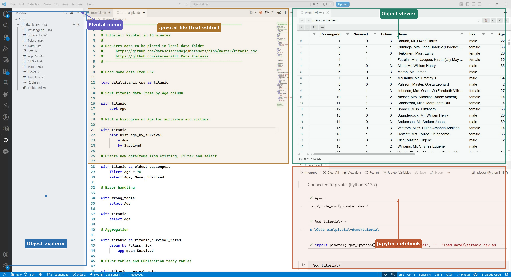
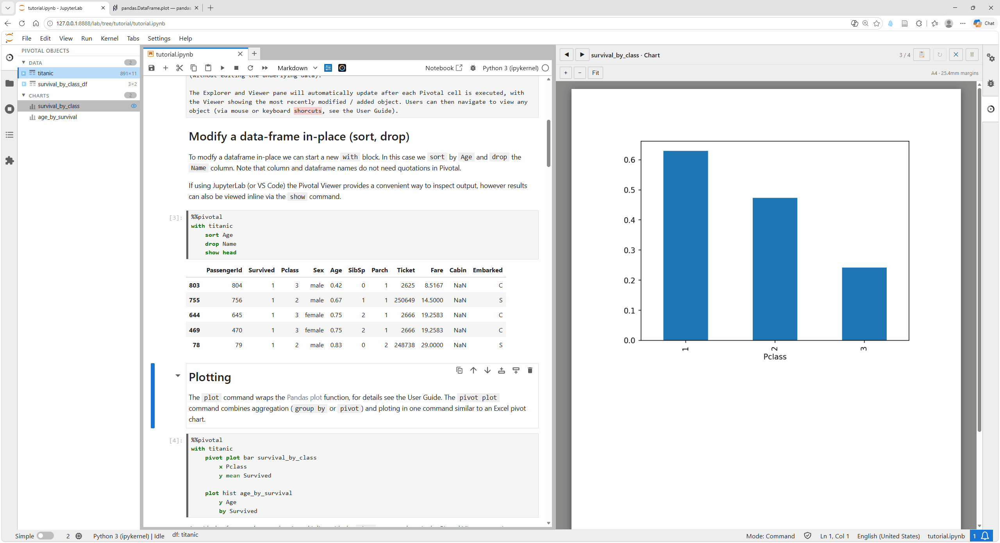
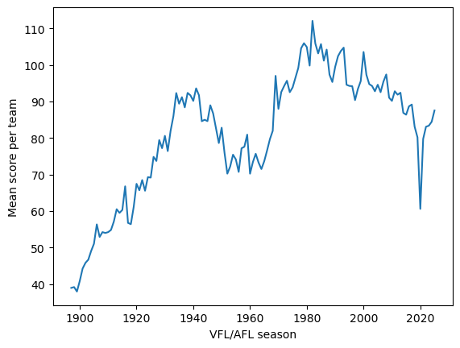
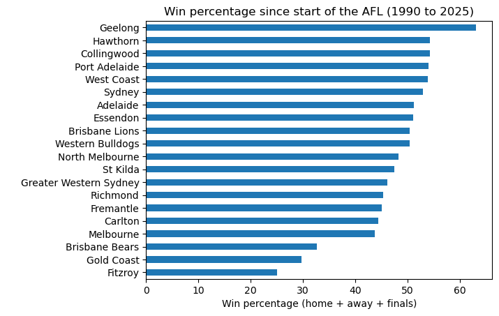
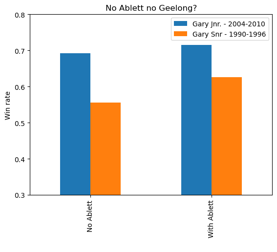

# Tutorial: 10 minutes to Pivotal

This is a short introduction to Pivotal, for more detail see the [User Guide](https://docs.pivotal-lang.org/syntax/) or the [Syntax Reference](https://docs.pivotal-lang.org/syntax/command-reference/). This tutorial runs in a Jupyter notebook and makes use of the Pivotal JupyterLab extension. For installation details see [Getting Started](https://docs.pivotal-lang.org/getting-started/) and [JupyterLab](https://docs.pivotal-lang.org/jupyter/).

## Import Pivotal and load some data

To begin import the Pivotal Python package.


```python
import pivotal
```

Now we can start a Pivotal cell by typing `%%pivotal` (or using the ALT + P shortcut). 


```pivotal
%%pivotal
load data\titanic.csv as titanic
```

The `load` command requires a filepath (with or without quotes, windows or unix style paths, local or relative paths or URLs). Data can be in CSV, Parquet or Excel format (detected from the file extension).

Data from SQL databases can also be loaded via the [`from`](https://docs.pivotal-lang.org/syntax/data-sources/) command.

## The Pivotal IDE (JupyterLab extension)

Once the data has loaded, the Pivotal Explorer (left pane) and Viewer (right pane) will become visible within JupyterLab:



The object explorer contains a list of all the objects in the current Pivotal session (dataframes, plots, tables, values) for now it will just contain the `titanic` dataframe. The Viewer provides a spreadsheet version of the `titanic` table with ability to scroll, sort, filter interactively (without editing the underlying data).

The Explorer and Viewer pane will automatically update after each Pivotal cell is executed, with the Viewer showing the most recently modified / added object. Users can then navigate to view any object via mouse or [keyboard shortcuts](https://docs.pivotal-lang.org/jupyter/#keyboard-shortcuts).

## Modify a data-frame in-place (sort, drop)

To modfy a dataframe in-place we can start a new `with` block. In this case we `sort` by `Age` and `drop` the `Name` column. Note that column and dataframe names do not need quotations in Pivotal.

If using JupyterLab (or VS Code) the Pivotal Viewer provides a convenient way to inspect output, however results can also be viewed inline via the `show` command.


```pivotal
%%pivotal
with titanic
    sort Age
    drop Name
    show head
```


<div>
<style scoped>
    .dataframe tbody tr th:only-of-type {
        vertical-align: middle;
    }

    .dataframe tbody tr th {
        vertical-align: top;
    }

    .dataframe thead th {
        text-align: right;
    }
</style>
<table border="1" class="dataframe">
  <thead>
    <tr style="text-align: right;">
      <th></th>
      <th>PassengerId</th>
      <th>Survived</th>
      <th>Pclass</th>
      <th>Sex</th>
      <th>Age</th>
      <th>SibSp</th>
      <th>Parch</th>
      <th>Ticket</th>
      <th>Fare</th>
      <th>Cabin</th>
      <th>Embarked</th>
    </tr>
  </thead>
  <tbody>
    <tr>
      <th>803</th>
      <td>804</td>
      <td>1</td>
      <td>3</td>
      <td>male</td>
      <td>0.42</td>
      <td>0</td>
      <td>1</td>
      <td>2625</td>
      <td>8.5167</td>
      <td>NaN</td>
      <td>C</td>
    </tr>
    <tr>
      <th>755</th>
      <td>756</td>
      <td>1</td>
      <td>2</td>
      <td>male</td>
      <td>0.67</td>
      <td>1</td>
      <td>1</td>
      <td>250649</td>
      <td>14.5000</td>
      <td>NaN</td>
      <td>S</td>
    </tr>
    <tr>
      <th>644</th>
      <td>645</td>
      <td>1</td>
      <td>3</td>
      <td>female</td>
      <td>0.75</td>
      <td>2</td>
      <td>1</td>
      <td>2666</td>
      <td>19.2583</td>
      <td>NaN</td>
      <td>C</td>
    </tr>
    <tr>
      <th>469</th>
      <td>470</td>
      <td>1</td>
      <td>3</td>
      <td>female</td>
      <td>0.75</td>
      <td>2</td>
      <td>1</td>
      <td>2666</td>
      <td>19.2583</td>
      <td>NaN</td>
      <td>C</td>
    </tr>
    <tr>
      <th>78</th>
      <td>79</td>
      <td>1</td>
      <td>2</td>
      <td>male</td>
      <td>0.83</td>
      <td>0</td>
      <td>2</td>
      <td>248738</td>
      <td>29.0000</td>
      <td>NaN</td>
      <td>S</td>
    </tr>
  </tbody>
</table>
</div>


## Plotting

The `plot` command wraps the [Pandas plot](https://pandas.pydata.org/docs/reference/api/pandas.DataFrame.plot.html) function; see [Charts, Tables, and Output](https://docs.pivotal-lang.org/syntax/output/) for details. The `pivot plot` command combines aggregation (`group by` or `pivot`) and plotting in one command similar to an Excel pivot chart.


```pivotal
%%pivotal
with titanic 
    pivot plot bar survival_by_class
        x Pclass
        y mean Survived  
        
    plot hist age_by_survival    
        y Age
        by Survived
```

As with dataframes, plots can be viewed inline with the `show` command or via the Pivotal Viewer pane (as shown here).



## Create new data-frame (filter, select)

Add an alias to the `with` statement to create a new dataframe. Here the`titanic` table remains unchanged.


```pivotal
%%pivotal
with titanic as oldest_passengers
    filter Age > 70
    select Age, Pclass, Survived
    show head
```


<div>
<style scoped>
    .dataframe tbody tr th:only-of-type {
        vertical-align: middle;
    }

    .dataframe tbody tr th {
        vertical-align: top;
    }

    .dataframe thead th {
        text-align: right;
    }
</style>
<table border="1" class="dataframe">
  <thead>
    <tr style="text-align: right;">
      <th></th>
      <th>Age</th>
      <th>Pclass</th>
      <th>Survived</th>
    </tr>
  </thead>
  <tbody>
    <tr>
      <th>116</th>
      <td>70.5</td>
      <td>3</td>
      <td>0</td>
    </tr>
    <tr>
      <th>493</th>
      <td>71.0</td>
      <td>1</td>
      <td>0</td>
    </tr>
    <tr>
      <th>96</th>
      <td>71.0</td>
      <td>1</td>
      <td>0</td>
    </tr>
    <tr>
      <th>851</th>
      <td>74.0</td>
      <td>3</td>
      <td>0</td>
    </tr>
    <tr>
      <th>630</th>
      <td>80.0</td>
      <td>1</td>
      <td>1</td>
    </tr>
  </tbody>
</table>
</div>


## Error handling

Pivotal offers native error messages which are easier to interpret than full Python tracebacks (although these are still available if required).


```pivotal
%%pivotal
with wrong_table
    select Age
```


<div style="font-family:monospace;padding:8px 12px;border-left:3px solid #e05252;background:#fff5f5;border-radius:3px;margin:4px 0;line-height:1.6"><span style="color:#c0392b;font-weight:bold">Pivotal Validation Error: Table &#x27;wrong_table&#x27; not found</span><br><span style="color:#555">&nbsp;&nbsp;→ Available tables: oldest_passengers, survival_by_class_df, titanic</span><details style="margin-top:6px"><summary style="cursor:pointer;color:#888;font-size:0.9em">Show full traceback</summary><pre style="background:#f8f8f8;padding:8px;margin-top:4px;font-size:0.82em;overflow-x:auto;color:#555;border-radius:3px">Traceback (most recent call last):
  File &quot;C:\Users\hughe\.conda\envs\pivotal\Lib\site-packages\IPython\core\interactiveshell.py&quot;, line 3699, in run_code
    exec(code_obj, self.user_global_ns, self.user_ns)
    ~~~~^^^^^^^^^^^^^^^^^^^^^^^^^^^^^^^^^^^^^^^^^^^^^
  File &quot;C:\Users\hughe\AppData\Local\Temp\ipykernel_27348\462969525.py&quot;, line 5, in &lt;module&gt;
    wrong_table = wrong_table.loc[:, [&#x27;Age&#x27;]]
                  ^^^^^^^^^^^
NameError: name &#x27;wrong_table&#x27; is not defined
</pre></details></div>


```pivotal
%%pivotal
with titanic
    select age
```


<div style="font-family:monospace;padding:8px 12px;border-left:3px solid #e05252;background:#fff5f5;border-radius:3px;margin:4px 0;line-height:1.6"><span style="color:#c0392b;font-weight:bold">Pivotal Validation Error: Unknown column &#x27;age&#x27; in &#x27;select&#x27; on table &#x27;titanic&#x27;</span><br><span style="color:#555">&nbsp;&nbsp;→ Did you mean &#x27;Age&#x27;?</span><details style="margin-top:6px"><summary style="cursor:pointer;color:#888;font-size:0.9em">Show full traceback</summary><pre style="background:#f8f8f8;padding:8px;margin-top:4px;font-size:0.82em;overflow-x:auto;color:#555;border-radius:3px">Traceback (most recent call last):
  File &quot;C:\Users\hughe\.conda\envs\pivotal\Lib\site-packages\IPython\core\interactiveshell.py&quot;, line 3699, in run_code
    exec(code_obj, self.user_global_ns, self.user_ns)
    ~~~~^^^^^^^^^^^^^^^^^^^^^^^^^^^^^^^^^^^^^^^^^^^^^
  File &quot;C:\Users\hughe\AppData\Local\Temp\ipykernel_27348\318122693.py&quot;, line 5, in &lt;module&gt;
    titanic = titanic.loc[:, [&#x27;age&#x27;]]
              ~~~~~~~~~~~^^^^^^^^^^^^
  File &quot;C:\Users\hughe\.conda\envs\pivotal\Lib\site-packages\pandas\core\indexing.py&quot;, line 1200, in __getitem__
    return self._getitem_tuple(key)
           ~~~~~~~~~~~~~~~~~~~^^^^^
  File &quot;C:\Users\hughe\.conda\envs\pivotal\Lib\site-packages\pandas\core\indexing.py&quot;, line 1386, in _getitem_tuple
    return self._getitem_lowerdim(tup)
           ~~~~~~~~~~~~~~~~~~~~~~^^^^^
  File &quot;C:\Users\hughe\.conda\envs\pivotal\Lib\site-packages\pandas\core\indexing.py&quot;, line 1093, in _getitem_lowerdim
    section = self._getitem_axis(key, axis=i)
  File &quot;C:\Users\hughe\.conda\envs\pivotal\Lib\site-packages\pandas\core\indexing.py&quot;, line 1438, in _getitem_axis
    return self._getitem_iterable(key, axis=axis)
           ~~~~~~~~~~~~~~~~~~~~~~^^^^^^^^^^^^^^^^
  File &quot;C:\Users\hughe\.conda\envs\pivotal\Lib\site-packages\pandas\core\indexing.py&quot;, line 1378, in _getitem_iterable
    keyarr, indexer = self._get_listlike_indexer(key, axis)
                      ~~~~~~~~~~~~~~~~~~~~~~~~~~^^^^^^^^^^^
  File &quot;C:\Users\hughe\.conda\envs\pivotal\Lib\site-packages\pandas\core\indexing.py&quot;, line 1576, in _get_listlike_indexer
    keyarr, indexer = ax._get_indexer_strict(key, axis_name)
                      ~~~~~~~~~~~~~~~~~~~~~~^^^^^^^^^^^^^^^^
  File &quot;C:\Users\hughe\.conda\envs\pivotal\Lib\site-packages\pandas\core\indexes\base.py&quot;, line 6302, in _get_indexer_strict
    self._raise_if_missing(keyarr, indexer, axis_name)
    ~~~~~~~~~~~~~~~~~~~~~~^^^^^^^^^^^^^^^^^^^^^^^^^^^^
  File &quot;C:\Users\hughe\.conda\envs\pivotal\Lib\site-packages\pandas\core\indexes\base.py&quot;, line 6352, in _raise_if_missing
    raise KeyError(f&quot;None of [{key}] are in the [{axis_name}]&quot;)
KeyError: &quot;None of [Index([&#x27;age&#x27;], dtype=&#x27;str&#x27;)] are in the [columns]&quot;
</pre></details></div>


## Aggregation (group by)

Following Pandas and R style syntax aggregation requires two commands: first `group by`, then `agg`. See [Grouping & Aggregation](https://docs.pivotal-lang.org/syntax/grouping/) for details.


```pivotal
%%pivotal
with titanic as titanic_survival_rates
    group by Pclass, Sex
        agg mean Survived
    show
```


<div>
<style scoped>
    .dataframe tbody tr th:only-of-type {
        vertical-align: middle;
    }

    .dataframe tbody tr th {
        vertical-align: top;
    }

    .dataframe thead th {
        text-align: right;
    }
</style>
<table border="1" class="dataframe">
  <thead>
    <tr style="text-align: right;">
      <th></th>
      <th>Pclass</th>
      <th>Sex</th>
      <th>Survived</th>
    </tr>
  </thead>
  <tbody>
    <tr>
      <th>0</th>
      <td>1</td>
      <td>female</td>
      <td>0.968085</td>
    </tr>
    <tr>
      <th>1</th>
      <td>1</td>
      <td>male</td>
      <td>0.368852</td>
    </tr>
    <tr>
      <th>2</th>
      <td>2</td>
      <td>female</td>
      <td>0.921053</td>
    </tr>
    <tr>
      <th>3</th>
      <td>2</td>
      <td>male</td>
      <td>0.157407</td>
    </tr>
    <tr>
      <th>4</th>
      <td>3</td>
      <td>female</td>
      <td>0.500000</td>
    </tr>
    <tr>
      <th>5</th>
      <td>3</td>
      <td>male</td>
      <td>0.135447</td>
    </tr>
  </tbody>
</table>
</div>


## Pivot tables

Now lets try the same aggregation, but this time use `pivot` to reshape the output with `Sex` across the columns. Note here we are overwriting the dataframe created in the previous step.


```pivotal
%%pivotal
with titanic as titanic_survival_rates
    pivot 
        rows Pclass
        cols Sex
        agg mean Survived
    show
```


<div>
<style scoped>
    .dataframe tbody tr th:only-of-type {
        vertical-align: middle;
    }

    .dataframe tbody tr th {
        vertical-align: top;
    }

    .dataframe thead th {
        text-align: right;
    }
</style>
<table border="1" class="dataframe">
  <thead>
    <tr style="text-align: right;">
      <th>Sex</th>
      <th>Pclass</th>
      <th>female</th>
      <th>male</th>
    </tr>
  </thead>
  <tbody>
    <tr>
      <th>0</th>
      <td>1</td>
      <td>0.968085</td>
      <td>0.368852</td>
    </tr>
    <tr>
      <th>1</th>
      <td>2</td>
      <td>0.921053</td>
      <td>0.157407</td>
    </tr>
    <tr>
      <th>2</th>
      <td>3</td>
      <td>0.500000</td>
      <td>0.135447</td>
    </tr>
  </tbody>
</table>
</div>


## Tables 

Pivotal supports generation of publication-ready tables via the Great Tables package, including ability to define merged cell headings via `spanner` command and apply number formats via `format` command. See [Charts, Tables, and Output](https://docs.pivotal-lang.org/syntax/output/) for the full table syntax.


```pivotal
%%pivotal
with titanic_survival_rates
    cast Pclass as string

    table survival_table
        title "Titanic survival rates by class and sex"
        stub Pclass "Passenger Class"
        label female as "F", male as "M"
        spanner female, male "Sex"
        format number 2
        show
```


<div id="rydlflkvas" style="padding-left:0pt;padding-right:0pt;padding-top:7.5pt;padding-bottom:7.5pt;overflow-x:auto;overflow-y:auto;width:auto;height:auto;">

<table class="gt_table" data-quarto-bootstrap="false" data-quarto-disable-processing="false" style="font-family: -apple-system, BlinkMacSystemFont, 'Segoe UI', Roboto, Oxygen, Ubuntu, Cantarell, 'Helvetica Neue', 'Fira Sans', 'Droid Sans', Arial, sans-serif;-webkit-font-smoothing: antialiased;-moz-osx-font-smoothing: grayscale;display: table;border-collapse: collapse;line-height: normal;margin-left: auto;margin-right: auto;color: #333333;font-size: 12pt;font-weight: normal;font-style: normal;background-color: #FFFFFF;width: auto;border-top-style: solid;border-top-width: 1.5pt;border-top-color: #A8A8A8;border-right-style: none;border-right-width: 1.5pt;border-right-color: #D3D3D3;border-bottom-style: solid;border-bottom-width: 1.5pt;border-bottom-color: #A8A8A8;border-left-style: none;border-left-width: 1.5pt;border-left-color: #D3D3D3;">
<thead style="border-style: none;">

  <tr class="gt_heading" style="border-style: none;background-color: #FFFFFF;text-align: center;border-bottom-color: #FFFFFF;border-left-style: none;border-left-width: 0.75pt;border-left-color: #D3D3D3;border-right-style: none;border-right-width: 0.75pt;border-right-color: #D3D3D3;">
    <td class="gt_heading gt_title gt_font_normal" colspan="3" style="border-style: none;color: #333333;font-size: 125%;font-weight: normal;padding-top: 3pt;padding-bottom: 3pt;padding-left: 3.75pt;padding-right: 3.75pt;border-bottom-color: #FFFFFF;border-bottom-width: 0;background-color: #FFFFFF;text-align: center;border-left-style: none;border-left-width: 0.75pt;border-left-color: #D3D3D3;border-right-style: none;border-right-width: 0.75pt;border-right-color: #D3D3D3;">Titanic survival rates by class and sex</td>
  </tr>
<tr class="gt_col_headings gt_spanner_row" style="border-style: none;background-color: transparent;border-top-style: solid;border-top-width: 1.5pt;border-top-color: #D3D3D3;border-bottom-style: hidden;border-bottom-width: 1.5pt;border-bottom-color: #D3D3D3;border-left-style: none;border-left-width: 0.75pt;border-left-color: #D3D3D3;border-right-style: none;border-right-width: 0.75pt;border-right-color: #D3D3D3;">
  <th class="gt_col_heading gt_columns_bottom_border gt_left" id="Passenger-Class" rowspan="2" colspan="1" style="border-style: none;color: #333333;background-color: #FFFFFF;font-size: 100%;font-weight: normal;text-transform: inherit;border-left-style: none;border-left-width: 0.75pt;border-left-color: #D3D3D3;border-right-style: none;border-right-width: 0.75pt;border-right-color: #D3D3D3;vertical-align: bottom;padding-top: 3.75pt;padding-bottom: 3.75pt;padding-left: 3.75pt;padding-right: 3.75pt;overflow-x: hidden;text-align: left;white-space: nowrap" scope="col">Passenger Class</th>
  <th class="gt_center gt_columns_top_border gt_column_spanner_outer" id="Sex" rowspan="1" colspan="2" scope="colgroup" style="border-style: none;color: #333333;background-color: #FFFFFF;font-size: 100%;font-weight: normal;text-transform: inherit;padding-top: 0;padding-bottom: 0;padding-left: 3pt;text-align: center;padding-right: 0;">
    <span class="gt_column_spanner" style="border-bottom-style: solid;border-bottom-width: 1.5pt;border-bottom-color: #D3D3D3;vertical-align: bottom;padding-top: 3.75pt;padding-bottom: 3.75pt;overflow-x: hidden;display: inline-block;width: 100%;">Sex</span>
  </th>
</tr>
<tr class="gt_col_headings" style="border-style: none;background-color: transparent;border-top-style: solid;border-top-width: 1.5pt;border-top-color: #D3D3D3;border-bottom-style: solid;border-bottom-width: 1.5pt;border-bottom-color: #D3D3D3;border-left-style: none;border-left-width: 0.75pt;border-left-color: #D3D3D3;border-right-style: none;border-right-width: 0.75pt;border-right-color: #D3D3D3;">
  <th class="gt_col_heading gt_columns_bottom_border gt_right" id="female" rowspan="1" colspan="1" scope="col" style="border-style: none;color: #333333;background-color: #FFFFFF;font-size: 100%;font-weight: normal;text-transform: inherit;border-left-style: none;border-left-width: 0.75pt;border-left-color: #D3D3D3;border-right-style: none;border-right-width: 0.75pt;border-right-color: #D3D3D3;vertical-align: bottom;padding-top: 3.75pt;padding-bottom: 3.75pt;padding-left: 3.75pt;padding-right: 3.75pt;overflow-x: hidden;text-align: right;font-variant-numeric: tabular-nums;">F</th>
  <th class="gt_col_heading gt_columns_bottom_border gt_right" id="male" rowspan="1" colspan="1" scope="col" style="border-style: none;color: #333333;background-color: #FFFFFF;font-size: 100%;font-weight: normal;text-transform: inherit;border-left-style: none;border-left-width: 0.75pt;border-left-color: #D3D3D3;border-right-style: none;border-right-width: 0.75pt;border-right-color: #D3D3D3;vertical-align: bottom;padding-top: 3.75pt;padding-bottom: 3.75pt;padding-left: 3.75pt;padding-right: 3.75pt;overflow-x: hidden;text-align: right;font-variant-numeric: tabular-nums;">M</th>
</tr>
</thead>
<tbody class="gt_table_body" style="border-style: none;border-top-style: solid;border-top-width: 1.5pt;border-top-color: #D3D3D3;border-bottom-style: solid;border-bottom-width: 1.5pt;border-bottom-color: #D3D3D3;">
  <tr style="border-style: none;background-color: transparent;">
    <th class="gt_row gt_left gt_stub" style="border-style: none;padding-top: 6pt;padding-bottom: 6pt;padding-left: 3.75pt;padding-right: 3.75pt;margin: 7.5pt;border-top-style: solid;border-top-width: 0.75pt;border-top-color: #D3D3D3;border-left-style: none;border-left-width: 0.75pt;border-left-color: #D3D3D3;border-right-style: solid;border-right-width: 1.5pt;border-right-color: #D3D3D3;vertical-align: middle;overflow-x: hidden;color: #333333;background-color: #FFFFFF;font-size: 100%;font-weight: initial;text-transform: inherit;text-align: left;white-space: nowrap">1</th>
    <td class="gt_row gt_right" style="border-style: none;padding-top: 6pt;padding-bottom: 6pt;padding-left: 3.75pt;padding-right: 3.75pt;margin: 7.5pt;border-top-style: solid;border-top-width: 0.75pt;border-top-color: #D3D3D3;border-left-style: none;border-left-width: 0.75pt;border-left-color: #D3D3D3;border-right-style: none;border-right-width: 0.75pt;border-right-color: #D3D3D3;vertical-align: middle;overflow-x: hidden;text-align: right;font-variant-numeric: tabular-nums;">0.97</td>
    <td class="gt_row gt_right" style="border-style: none;padding-top: 6pt;padding-bottom: 6pt;padding-left: 3.75pt;padding-right: 3.75pt;margin: 7.5pt;border-top-style: solid;border-top-width: 0.75pt;border-top-color: #D3D3D3;border-left-style: none;border-left-width: 0.75pt;border-left-color: #D3D3D3;border-right-style: none;border-right-width: 0.75pt;border-right-color: #D3D3D3;vertical-align: middle;overflow-x: hidden;text-align: right;font-variant-numeric: tabular-nums;">0.37</td>
  </tr>
  <tr style="border-style: none;background-color: transparent;">
    <th class="gt_row gt_left gt_stub" style="border-style: none;padding-top: 6pt;padding-bottom: 6pt;padding-left: 3.75pt;padding-right: 3.75pt;margin: 7.5pt;border-top-style: solid;border-top-width: 0.75pt;border-top-color: #D3D3D3;border-left-style: none;border-left-width: 0.75pt;border-left-color: #D3D3D3;border-right-style: solid;border-right-width: 1.5pt;border-right-color: #D3D3D3;vertical-align: middle;overflow-x: hidden;color: #333333;background-color: #FFFFFF;font-size: 100%;font-weight: initial;text-transform: inherit;text-align: left;white-space: nowrap">2</th>
    <td class="gt_row gt_right" style="border-style: none;padding-top: 6pt;padding-bottom: 6pt;padding-left: 3.75pt;padding-right: 3.75pt;margin: 7.5pt;border-top-style: solid;border-top-width: 0.75pt;border-top-color: #D3D3D3;border-left-style: none;border-left-width: 0.75pt;border-left-color: #D3D3D3;border-right-style: none;border-right-width: 0.75pt;border-right-color: #D3D3D3;vertical-align: middle;overflow-x: hidden;text-align: right;font-variant-numeric: tabular-nums;">0.92</td>
    <td class="gt_row gt_right" style="border-style: none;padding-top: 6pt;padding-bottom: 6pt;padding-left: 3.75pt;padding-right: 3.75pt;margin: 7.5pt;border-top-style: solid;border-top-width: 0.75pt;border-top-color: #D3D3D3;border-left-style: none;border-left-width: 0.75pt;border-left-color: #D3D3D3;border-right-style: none;border-right-width: 0.75pt;border-right-color: #D3D3D3;vertical-align: middle;overflow-x: hidden;text-align: right;font-variant-numeric: tabular-nums;">0.16</td>
  </tr>
  <tr style="border-style: none;background-color: transparent;">
    <th class="gt_row gt_left gt_stub" style="border-style: none;padding-top: 6pt;padding-bottom: 6pt;padding-left: 3.75pt;padding-right: 3.75pt;margin: 7.5pt;border-top-style: solid;border-top-width: 0.75pt;border-top-color: #D3D3D3;border-left-style: none;border-left-width: 0.75pt;border-left-color: #D3D3D3;border-right-style: solid;border-right-width: 1.5pt;border-right-color: #D3D3D3;vertical-align: middle;overflow-x: hidden;color: #333333;background-color: #FFFFFF;font-size: 100%;font-weight: initial;text-transform: inherit;text-align: left;white-space: nowrap">3</th>
    <td class="gt_row gt_right" style="border-style: none;padding-top: 6pt;padding-bottom: 6pt;padding-left: 3.75pt;padding-right: 3.75pt;margin: 7.5pt;border-top-style: solid;border-top-width: 0.75pt;border-top-color: #D3D3D3;border-left-style: none;border-left-width: 0.75pt;border-left-color: #D3D3D3;border-right-style: none;border-right-width: 0.75pt;border-right-color: #D3D3D3;vertical-align: middle;overflow-x: hidden;text-align: right;font-variant-numeric: tabular-nums;">0.50</td>
    <td class="gt_row gt_right" style="border-style: none;padding-top: 6pt;padding-bottom: 6pt;padding-left: 3.75pt;padding-right: 3.75pt;margin: 7.5pt;border-top-style: solid;border-top-width: 0.75pt;border-top-color: #D3D3D3;border-left-style: none;border-left-width: 0.75pt;border-left-color: #D3D3D3;border-right-style: none;border-right-width: 0.75pt;border-right-color: #D3D3D3;vertical-align: middle;overflow-x: hidden;text-align: right;font-variant-numeric: tabular-nums;">0.14</td>
  </tr>
</tbody>


</table>

</div>


## Parameters (Scalars, Lists, and Dictionaries)

Pivotal also supports definition of Scalars, Lists and Dictionaries. Note that within Pivotal brackets for lists are optional. See [Values: Scalars, Dicts, and Lists](https://docs.pivotal-lang.org/syntax/values/) for more detail.

In Pivotal the sole purpose of these parameter objects is to pass metadata to dataframe operations:


```pivotal
%%pivotal
list mylist = Age, Survived, Pclass

scalar myvar = 20

dict config
    column_lists
        compact = Age, Pclass
    thresholds
        adult_age = 18

# dict config from config.json   # load from json or yaml

with titanic as temp
    filter Age > myvar
    select mylist

with titanic as adults
    filter Age >= config.thresholds.adult_age
    select config.column_lists.compact
```

Under the hood all Pivotal objects are just Python objects. Any dataframe, Scalar, List or Dictionary defined in Pivotal exists in the Python namespace and can be accessed within Python code cells:


```python
# Python code
print(f'myvar: {myvar}') 
print(config)
print(temp.head())
print(adults.head())
```

    myvar: 20
          Age  Survived  Pclass
    227  20.5         0       3
    402  21.0         0       3
    408  21.0         0       3
    102  21.0         0       1
    627  21.0         1       1
    

Varaibles defined in Python can also be accessed within Pivotal code by adding a `:` prefix:


```python
# Python code
pylist = ["Pclass", "Parch"]
pyvar = 3
```


```pivotal
%%pivotal
with titanic as temp
    filter Parch > :pyvar
    select :pylist
    show head
```


<div>
<style scoped>
    .dataframe tbody tr th:only-of-type {
        vertical-align: middle;
    }

    .dataframe tbody tr th {
        vertical-align: top;
    }

    .dataframe thead th {
        text-align: right;
    }
</style>
<table border="1" class="dataframe">
  <thead>
    <tr style="text-align: right;">
      <th></th>
      <th>Pclass</th>
      <th>Parch</th>
    </tr>
  </thead>
  <tbody>
    <tr>
      <th>567</th>
      <td>3</td>
      <td>4</td>
    </tr>
    <tr>
      <th>25</th>
      <td>3</td>
      <td>5</td>
    </tr>
    <tr>
      <th>885</th>
      <td>3</td>
      <td>5</td>
    </tr>
    <tr>
      <th>13</th>
      <td>3</td>
      <td>5</td>
    </tr>
    <tr>
      <th>610</th>
      <td>3</td>
      <td>5</td>
    </tr>
  </tbody>
</table>
</div>


## Mutation (column expressions)

Columns can be modified and added with a simple `newcol = <expression>` syntax. Below we add two new columns in preparation for some data analysis: 


```pivotal
%%pivotal
with titanic as X
    family = Parch + SibSp

    male = 1
        where Sex == "male"
        else 0
```

Above we add a new column for the total family members on-board (Parents & Children `Parch` + Siblings and Spouses `SibSp`). Second, we apply a conditional assignment (via an indented `where` clause) to define a binary `male` column.

## Data cleaning

Next we need to handle missing values in the `Age` column. First we use an aggregation function `median()` (in this case grouped by `Sex` and `Pclass` via an indented `by` clause) to create some replacement values. Then the `fillna` command is used to replace NAs in `Age` with `median_age`. 

Last we include an `assert` command as a quality check on our data preparation pipeline. This will throw an error if we have missed any NAs.


```pivotal
%%pivotal
list features = Age, Age2, family, male, Fare

with X
    median_age = median(Age)
        by Sex, Pclass  
    fillna Age median_age
    
    Age2 = Age**2

    select features 

    # Should be no NAs here 
    assert features not null
```


```pivotal
%%pivotal
with titanic
    # Some NAs here 
    assert Age not null
```


<div style="font-family:monospace;padding:8px 12px;border-left:3px solid #e05252;background:#fff5f5;border-radius:3px;margin:4px 0;line-height:1.6"><span style="color:#c0392b;font-weight:bold">Pivotal Runtime Error: An error occurred while executing your Pivotal script</span><br><span style="color:#555">&nbsp;&nbsp;→ [Pivotal] assert failed on titanic: Age must not be null: 177 row(s)</span><details style="margin-top:6px"><summary style="cursor:pointer;color:#888;font-size:0.9em">Show full traceback</summary><pre style="background:#f8f8f8;padding:8px;margin-top:4px;font-size:0.82em;overflow-x:auto;color:#555;border-radius:3px">Traceback (most recent call last):
  File &quot;C:\Users\hughe\.conda\envs\pivotal\Lib\site-packages\IPython\core\interactiveshell.py&quot;, line 3699, in run_code
    exec(code_obj, self.user_global_ns, self.user_ns)
    ~~~~^^^^^^^^^^^^^^^^^^^^^^^^^^^^^^^^^^^^^^^^^^^^^
  File &quot;C:\Users\hughe\AppData\Local\Temp\ipykernel_42152\124378638.py&quot;, line 6, in &lt;module&gt;
    if _pvt_dq_bad: raise AssertionError(f&quot;[Pivotal] assert failed on titanic: Age must not be null: {_pvt_dq_bad} row(s)&quot;)
                    ^^^^^^^^^^^^^^^^^^^^^^^^^^^^^^^^^^^^^^^^^^^^^^^^^^^^^^^^^^^^^^^^^^^^^^^^^^^^^^^^^^^^^^^^^^^^^^^^^^^^^^^
AssertionError: [Pivotal] assert failed on titanic: Age must not be null: 177 row(s)
</pre></details></div>


## Python analysis

Now lets jump into Python to do some analysis. In this case a simple linear regression to predict survival of Titanic passengers, using the `titanic` and `X` dataframes we built in Pivotal:


```python
import statsmodels.api as sm
model = sm.Logit(titanic.Survived, X).fit()
print(model.summary())
titanic["predicted"] = model.predict(X)
```

    Optimization terminated successfully.
             Current function value: 0.494549
             Iterations 6
                               Logit Regression Results                           
    ==============================================================================
    Dep. Variable:               Survived   No. Observations:                  891
    Model:                          Logit   Df Residuals:                      886
    Method:                           MLE   Df Model:                            4
    Date:                Fri, 15 May 2026   Pseudo R-squ.:                  0.2573
    Time:                        13:36:27   Log-Likelihood:                -440.64
    converged:                       True   LL-Null:                       -593.33
    Covariance Type:            nonrobust   LLR p-value:                 7.526e-65
    ==============================================================================
                     coef    std err          z      P>|z|      [0.025      0.975]
    ------------------------------------------------------------------------------
    Age            0.0348      0.010      3.329      0.001       0.014       0.055
    Age2          -0.0005      0.000     -2.402      0.016      -0.001   -9.09e-05
    family        -0.1962      0.056     -3.505      0.000      -0.306      -0.087
    male          -2.3253      0.175    -13.267      0.000      -2.669      -1.982
    Fare           0.0168      0.003      5.954      0.000       0.011       0.022
    ==============================================================================
    

Since we have added a new column to the `titanic` table in Python it is good idea to update the Pivotal UI (Object Explorer / Viewer) via the `update` method, after which we will see the new `predicted` column in the `titanic` table.


```python
pivotal.update()
```

    [Pivotal] Updated viewer: titanic, survival_by_class_df, oldest_passengers, titanic_survival_rates, temp, X
    

## Save to data package 

The Pivotal `save` command exports all data-frames, plots and tables in the current session to a Frictionless data package (a simple folder structure with overarching JSON metadata). 

At this point we have accumulated 6 data-frames, 2 charts and 1 table. We can choose which of these to include / exclude from the save, but for now lets just save all of them. By default charts are saved as both `png` images and `csv` data files.


```pivotal
%%pivotal
save "titanic_results"
```

    Package 'titanic_results' saved to C:\pivotal-demo\tutorial\titanic_results (6 dataframe(s), 2 chart(s), 1 table(s), 3 parameter(s))
    <pivotal.package.Package at 0x1e16213a270>


```python
from directory_tree import DisplayTree
DisplayTree('titanic_results')
```

    titanic_results/
    ├── charts/
    │   ├── age_by_survival.csv
    │   ├── age_by_survival.png
    │   ├── survival_by_class.csv
    │   └── survival_by_class.png
    ├── data/
    │   ├── oldest_passengers.csv
    │   ├── survival_by_class_df.csv
    │   ├── temp.csv
    │   ├── titanic.csv
    │   ├── titanic_survival_rates.csv
    │   └── X.csv
    ├── datapackage.json
    ├── parameters.json
    └── tables/
        └── survival_table.html
    

## Football statistics (bulk load) 

Let's now have a look at some Australian football statistics. This data (taken from [akareen/AFL-Data-Analaysis](https://github.com/akareen/AFL-Data-Analysis) on Github) are stored as a large number (129) CSV files (one for each year of VFL/AFL competition). 

The `bulk load` command can be applied here to loop over all the data files in a folder, and concatenate to a single table. 


```pivotal
%%pivotal
bulk load "data\AFL\matches" as afl_games
```

## Column loops and case assignment

Below we introduce some new Pivotal syntax: Column-wise loops. These can be useful in situations where we need to apply the same assignment / mutation to multiple columns, in this case a string replace function applied to `team_1_team_name` (Home team) and `team_2_team_name` (Away team).

The last statement is a "Case assignment" which allow for multiple `where` conditions and an optional default `else` value.


```pivotal
%%pivotal
with afl_games 
    team_2_score = team_2_final_goals*6 + team_2_final_behinds 
    team_1_score = team_1_final_goals*6 + team_1_final_behinds
    team_score = (team_1_score + team_2_score)/2 
   
    #  Column loop 
    for col in team_1_team_name, team_2_team_name
        col = replace(col, "Kangaroos", "North Melbourne")
        col = replace(col, "Footscray", "Western Bulldogs")

    pivot plot line long_term_scoring_trend
        x year "VFL/AFL season"
        y mean team_score "Mean score per team"
        show

    #  Case assignment
    winner =
        where team_1_score > team_2_score: team_1_team_name
        where team_2_score > team_1_score: team_2_team_name
        else "draw"
```





## Pipeline functions 

Pivotal also supports functions, which group together a reusable sequence of data operations (a pipeline).

In this example we apply the same operations (via the `ha_games` function) to the home and away teams in the `afl_games` table, then combine them into a single set of results for each team in each round.  

Pivotal functions are non-recursive (i.e., more like Excel macros than Python functions), but they can still be called from within Python code if needed; see [Pipeline Control](https://docs.pivotal-lang.org/syntax/pipeline-control/) for details.


```pivotal
%%pivotal
function ha_games(input, output, col)

    with input as output
        select col, winner, year, date
        win = 1
            where col == winner
            else 0
        select col as team_name, win, year, date
        filter year >= 1990

ha_games(afl_games, home_games, team_1_team_name)
ha_games(afl_games, away_games, team_2_team_name)

with home_games as all_games
    concat away_games

with all_games as all_games_mean    
    group by team_name
        agg mean win
    sort win
    win = win * 100
    plot barh win_rate_since_1990
        x team_name " "
        y win "Win percentage (home + away + finals)"
        title "Win percentage since start of the AFL (1990 to 2025)"
        show
```





## Merging 

The syntax of the Pivotal `merge` command should be familiar to regular Pandas users. Below we add an extra column `players` (names of players from each game). Since our `cats_lineup` table only includes one team and we use an `inner` merge, we're left with fewer rows (the 832 Geelong Cats games between 1990 and 2025).


```pivotal
%%pivotal
load data\AFL\lineups\team_lineups_geelong.csv as cats_lineup

with cats_lineup
    select date, team_name, players

with all_games as games_with_lineup
    show shape
    inner merge cats_lineup on team_name, date
    show shape
```


```text
(13366, 4)
(832, 5)
```


## Self-indulgent Gary Ablett reference 

No new syntax here. Just some stats showing the Geelong Cats win-rate with and without Gary Ablett (Senior/Junior) in the team.


```pivotal
%%pivotal
with games_with_lineup
    ablett = "With Ablett"
        where players contains "Gary Ablett"
        else "No Ablett"
    
    era =
        where year<=1996: "Gary Snr - 1990-1996"
        where year>=2004 and year <2011: "Gary Jnr. - 2004-2010"
        #where year>2018 and year <2021: "Gary Jnr. return - 2018-2020"

    pivot plot bar no_ablett
        x ablett " "
        y mean win "Win rate"
        by era
        ylim 0.3, 0.8
        title "No Ablett no Geelong?"
        show 
```



